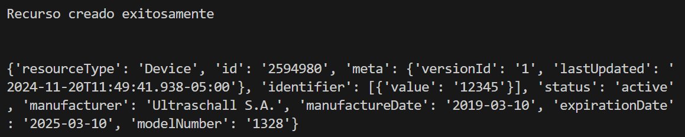

# Recurso elegido: Device

Este recurso se utiliza para tener registro de los dispositivos con los que se cuenta, incluyendo la información del mismo y su estado. 
Es un recurso bastante amplio, que incluye equipos médicos, dispositivos implantables y equipamento reutilizable y de un solo uso. También 
incluye ciertos tipos de software. El recurso Device es referenciado por otros para registrar qué equipo fue utilizado en un estudio o qué
dispositivo fue implantado o removido del paciente.

# Elementos del recurso

Dado que el recurso contempla una gran variedad de dispositivos, sus campos deben ser flexibles para permitir la covertura de todo el rango.
Los elementos que se consideraron para la creación del recurso fueron los siguientes:

* Nombre del dispositivo
* Estado (activo / inactivo / error)
* Fabricante
* Número de modelo
* Fecha de fabricación
* Fecha de expiración
* ID

# Funciones utilizadas

## Creación del recurso

```python
def create_device_resource(name=None, status=None, manufacturer=None, model_number=None, manufacture_date=None, expiration_date=None, id=None):
    device = Device()
    
    if name:
        device.displayName = name
    if status:
        device.status = status
    if manufacturer:
        device.manufacturer = manufacturer
    if model_number:
        device.modelNumber = model_number
    if manufacture_date:
        device.manufactureDate = manufacture_date
    if expiration_date:
        device.expirationDate = expiration_date
    if id:
        identifier = Identifier()
        identifier.value = id
        device.identifier = [identifier]

    return device
```

## Envío del recurso al servidor

```python
def send_resource_to_hapi_fhir(resource, resource_type, url_alternativo = False):
    if url_alternativo:
        url = f"https://launch.smarthealthit.org/v/r4/fhir/{resource_type}"
    else:
        url = f"http://hapi.fhir.org/baseR5/{resource_type}"
    headers = {"Content-Type": "application/fhir+json"}
    resource_json = resource.json()

    response = requests.post(url, headers=headers, data=resource_json)

    if response.status_code == 201:
        print("Recurso creado exitosamente")
        
        return response.json()['id']
    else:
        print(f"Error al crear el recurso: {response.status_code}")
        print(response.json())
        return None
```

## Lectura del recurso creado

```python
def get_resource_from_hapi_fhir(resource_id, resource_type, url_alternativo = False):
    if url_alternativo:
        url = f"https://launch.smarthealthit.org/v/r4/fhir/{resource_type}/{resource_id}"
    else:
        url = f"http://hapi.fhir.org/baseR5/{resource_type}/{resource_id}"
    response = requests.get(url, headers={"Accept": "application/fhir+json"})

    if response.status_code == 200:
        resource = response.json()
        print(resource)
    else:
        print(f"Error al obtener el recurso: {response.status_code}")
        print(response.json())
```

# Resultado de ejecución

